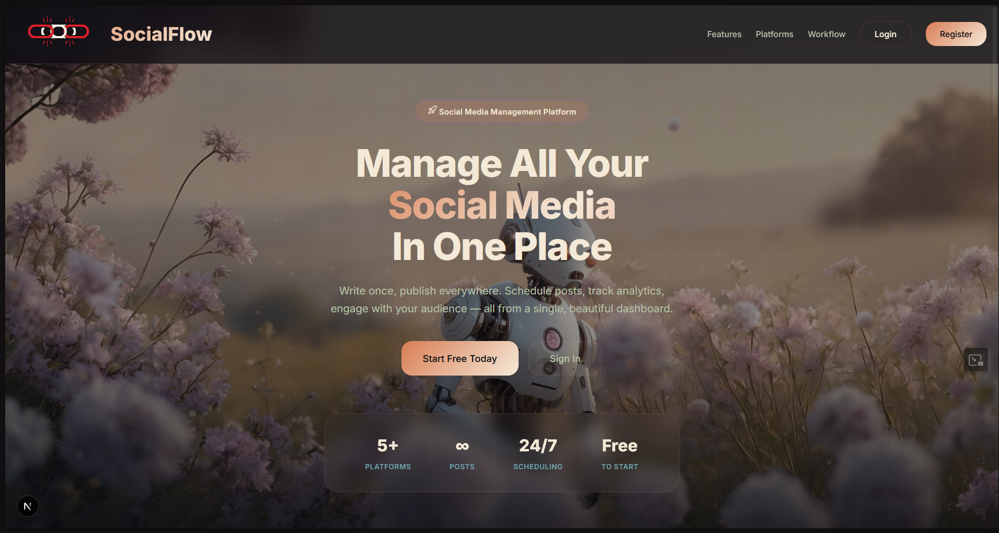

<div align="center">

# 🚀 SocialFlow

### AI-Powered Multi-Platform Social Media Management

[](https://nextjs.org/)
[](https://spring.io/)
[](https://fastapi.tiangolo.com/)
[](https://neon.tech/)
[](https://www.docker.com/)
[](https://kubernetes.io/)
[](https://www.terraform.io/)
[](https://docs.gitlab.com/ee/ci/)

**Create brand-aligned content with AI, edit it in a rich in-browser studio, and publish to Facebook, Instagram, Threads & LinkedIn — all from one place.**



<a href="#-about">About</a> ·
<a href="#-features">Features</a> ·
<a href="#%EF%B8%8F-tech-stack">Tech Stack</a> ·
<a href="#-architecture">Architecture</a> ·
<a href="#-getting-started">Getting Started</a> ·
<a href="#-deployment--ci-cd">Deployment</a>

</div>

---

## 📖 About

**SocialFlow** is a full-stack, cloud-native platform that turns a brand's voice into ready-to-publish social content. It pairs a **multimodal AI pipeline** (text, image, and RAG-grounded brand knowledge) with an **in-browser content studio** (3D, video & canvas editing) and a **multi-platform publisher** with analytics and a unified inbox.

> **Why SocialFlow?**
> - **One studio, many platforms** — write once, publish to Facebook, Instagram, Threads and LinkedIn through real platform APIs.
> - **Brand-aware AI** — content is grounded in your brand knowledge via RAG, so it always sounds on-brand.
> - **Edit everything in the browser** — trim video (FFmpeg WASM), design on canvas (Fabric.js), even run models client-side (Transformers.js).
> - **Built like production** — Docker, Kubernetes, Terraform and GitLab CI/CD from day one.

---

## ✨ Features

| Category | Features |
|----------|----------|
| **🤖 AI Content** | • **Brand-aligned text generation** (Groq + OpenRouter LLMs)<br>• **AI image generation** (Pixazo) + **Unsplash** stock library<br>• **RAG** over brand knowledge for on-brand output<br>• API-key rotation across providers |
| **🎬 Content Studio** | • **In-browser video editing** (FFmpeg WASM)<br>• **Canvas / image editor** (Fabric.js, crop)<br>• **3D** elements (Three.js)<br>• Client-side AI (Hugging Face Transformers.js) + Markdown rendering |
| **📣 Publishing** | • **Facebook**, **Instagram**, **Threads**, **LinkedIn** via official APIs<br>• OAuth connect + reconnect (token upsert, no duplicates)<br>• **Scheduling** (background publisher for due posts)<br>• Webhook verification & event handling |
| **📊 Analytics & Inbox** | • Post & page analytics with history snapshots<br>• Aggregated overview (top posts, totals, engagement)<br>• **Unified inbox** — comments & replies across platforms |
| **⚙️ Platform / DevOps** | • JWT auth, Flyway migrations, Swagger/OpenAPI docs<br>• Prometheus + Actuator metrics<br>• Docker Compose **and** Kubernetes (K3s) targets<br>• GitLab CI/CD → AWS ECR → EC2, Terraform IaC |

> ℹ️ **X/Twitter** and **Bluesky** connectors exist in the codebase, but are not active in the current production configuration.

---

## 🛠️ Tech Stack

### 🖥️ Frontend — `frontend/` (port 3000)
- **Framework:** Next.js 16 (App Router) · React 19 · TypeScript
- **Content studio:** Three.js (`@react-three/fiber`), FFmpeg WASM, Fabric.js, react-easy-crop
- **In-browser AI:** Hugging Face Transformers.js
- **Other:** react-markdown + remark-gfm, social previews, Unsplash integration

### ⚙️ Backend — `backend/` (port 8080)
- **Framework:** Spring Boot 3.2.3 · Java 17
- **Data:** Spring Data JPA · PostgreSQL (Neon serverless) · Flyway migrations
- **Security:** Spring Security + JWT (jjwt), BCrypt
- **Integrations:** Spring WebFlux WebClient, Cloudinary (media hosting), Springdoc OpenAPI/Swagger
- **Observability:** Spring Actuator + Micrometer Prometheus

### 🧠 AI Service — `ai-service/` (port 5000)
- **Framework:** FastAPI (Python)
- **Providers:** Groq, OpenRouter (LLM text) · Pixazo (image) · pluggable provider abstraction + API-key rotation
- **Capabilities:** content & image generation, chat, embeddings, RAG models

### 🗄️ Data & Infra
- **Database:** Neon serverless PostgreSQL (shared by backend + AI service)
- **Proxy:** Nginx (TLS termination)
- **IaC:** Terraform · Kubernetes manifests (`k8s/`) · `infra/`

---

## 🧩 Architecture

```
                    ┌──────────────┐
       Users ──────▶│   Nginx :443 │  (TLS, reverse proxy)
                    └──────┬───────┘
              ┌────────────┼────────────┐
              ▼            ▼            ▼
       ┌────────────┐ ┌──────────┐ ┌──────────────┐
       │ Frontend   │ │ Backend  │ │  AI Service  │
       │ Next.js    │ │ Spring   │ │  FastAPI     │
       │ :3000      │ │ Boot:8080│ │  :5000       │
       └────────────┘ └────┬─────┘ └──────┬───────┘
                           │              │
                           └──────┬───────┘
                                  ▼
                       ┌────────────────────┐
                       │  Neon PostgreSQL   │
                       └────────────────────┘

  External APIs: Groq · OpenRouter · Pixazo · Cloudinary · Unsplash
                 Facebook · Instagram · Threads · LinkedIn · RapidAPI · SerpAPI
```

The frontend is the only externally-exposed domain; `/api/*` is proxied to the backend. Backend and AI service share the same Neon database.

---

## 🚀 Getting Started

### Prerequisites
- **Java 17** + **Maven** (backend)
- **Node.js 20+** (frontend)
- **Python 3.10+** (AI service)
- **Docker** + **Docker Compose** (for the containerized setup)
- A **Neon** (or any) PostgreSQL database
- API keys: Groq / OpenRouter / Pixazo (AI), Cloudinary (media), OAuth credentials for the social platforms you want to use

### Configuration

Each service reads its own environment. For Docker Compose, provide a root `.env` (see the variables referenced in `docker-compose.yml`). For local dev, copy each service's `.env.example` → `.env`:

```env
# Database (Neon)
SPRING_DATASOURCE_URL=jdbc:postgresql://<neon-host>/neondb?sslmode=require
SPRING_DATASOURCE_USERNAME=...
SPRING_DATASOURCE_PASSWORD=...

# AI providers
GROQ_API_KEY=...
OPENROUTER_API_KEY=...
PIXAZO_API_KEY=...

# Media + search
CLOUDINARY_CLOUD_NAME=...
UNSPLASH_ACCESS_KEY=...

# Social platform OAuth (per platform)
FACEBOOK_CLIENT_ID=...
LINKEDIN_CLIENT_ID=...
THREADS_CLIENT_ID=...
INSTAGRAM_CLIENT_ID=...
```

### ⚡ Run with Docker Compose (recommended)

```bash
docker compose up --build -d
```

This starts **backend (8080)**, **ai-service (5000)**, **frontend (3000)** and **nginx (80/443)**.

### 🔧 Run manually (development)

```bash
# 1. Backend (port 8080)
cd backend
mvn spring-boot:run

# 2. AI service (port 5000)
cd ai-service
pip install -r requirements.txt
uvicorn app.main:app --reload --port 5000

# 3. Frontend (port 3000)
cd frontend
npm install
npm run dev
```

Then open **http://localhost:3000**.

> 📖 **API docs:** once the backend is running, the interactive Swagger UI is available at `http://localhost:8080/swagger-ui.html` (Springdoc OpenAPI).

---

## 🛳️ Deployment & CI/CD

SocialFlow ships with a production-grade pipeline:

```
 push (main) ──▶ GitLab CI ──▶ build 3 images ──▶ push to AWS ECR
                                   │
                                   ▼
                         SSH → EC2  (DEPLOY_TARGET)
                          ├── "compose" → docker compose up   (default)
                          └── "k8s"      → kubectl apply (K3s)
```

- **`.gitlab-ci.yml`** — 2 stages (`build`, `deploy`); builds `backend`, `frontend`, `ai_service` and pushes to ECR.
- **`DEPLOY_TARGET`** CI variable switches between **Docker Compose** and **Kubernetes (K3s)** on the EC2 host.
- **`terraform/`** — infrastructure as code for the AWS resources.
- **`k8s/`** — templated Kubernetes manifests (env-substituted at deploy time).
- **`nginx.conf`** — reverse proxy with TLS; production is fronted by Cloudflare at **socialflow.io.vn**.

---

## 📂 Project Structure

```
SocialFlow/
├── ai-service/        # FastAPI AI service (Groq, OpenRouter, Pixazo, RAG)
├── backend/           # Spring Boot REST API (Java 17)
├── frontend/          # Next.js 16 app + content studio
├── infra/             # ancillary infra configs
├── k8s/               # Kubernetes manifests
├── terraform/         # AWS IaC
├── docker-compose.yml # local + production orchestration
├── nginx.conf         # reverse proxy + TLS
├── .gitlab-ci.yml     # CI/CD pipeline
└── PROJECT_SUMMARY.md # detailed architecture & data-model reference
```

---

## 📝 License

Distributed under the **The Unlicense** — free for any use. See [`LICENSE`](./LICENSE) for details.

[](./LICENSE)

</div>
